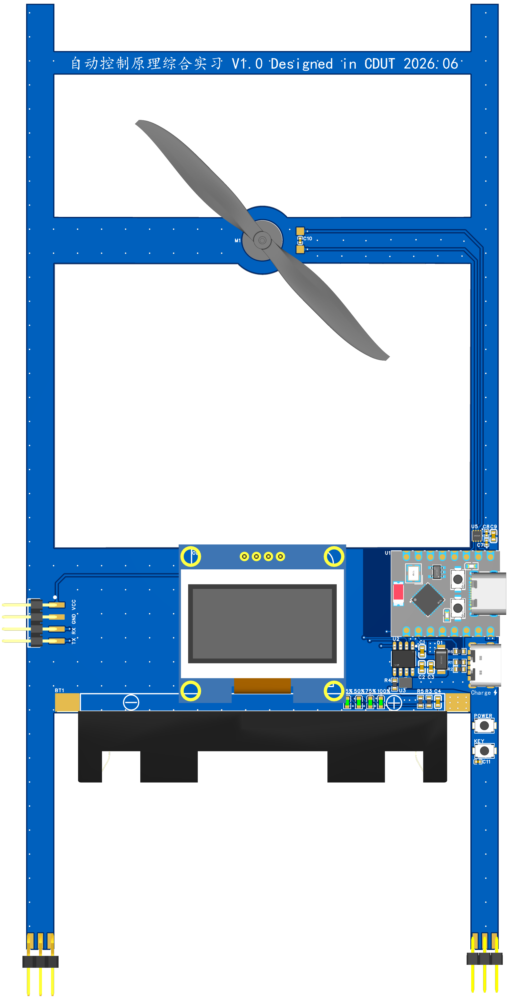

# 平衡梯 Balance Ladder



平衡梯是一个用于自动控制原理课程设计的主动平衡实验平台。项目采用 H 型 PCB 作为主体结构，底部尖脚形成不稳定支撑，中上部的 8520 空心杯电机和螺旋桨提供控制推力。ESP32-C3 读取 MPU6050 姿态数据，通过 DRV8837 控制电机输出，使整块 PCB 在目标角度附近保持平衡。

这个项目重点展示自动控制系统中的开环不稳定、闭环反馈、PID 调参、执行器饱和、抗扰动和目标角跟踪。它不是实际可用的梯子，而是一个可观察、可调参、可演示的课程设计控制对象。

## 项目状态

| 项目 | 状态 |
|---|---|
| 硬件版本 | V1.0 |
| 主控 | ESP32-C3 SuperMini |
| 姿态传感器 | MPU6050 |
| 电机驱动 | DRV8837 单路 H 桥 |
| 电机 | 8520 空心杯电机 + 螺旋桨 |
| 电源 | 单节 18650 + FM5324H 充电/升压到 5 V |
| 显示 | 0.96 inch I2C OLED |
| 固件平台 | VSCode + ESP-IDF |
| 调试方式 | USB Serial/JTAG 日志 + BLE 调参遥测 + Web 调试助手 |
| 在线调试工具 | <https://liziyaaa.github.io/balance_ladder/> |

## 功能目标

基础目标：

- 平衡梯在 90 deg 直立附近保持稳定。
- 在 75-105 deg 范围内给定目标角并保持平衡。

进阶目标：

- 精准到达 75-105 deg 中的指定角度。
- 通过 BLE/Web 页面记录角度误差、电机输出和状态。
- 人为轻微扰动后自动恢复到目标角。

高阶展示：

- 尝试双层叠放平衡梯。
- 上层风力摆在 80-100 deg 范围内摆动或保持可控响应。

## 系统组成

| 模块 | 作用 |
|---|---|
| H 型 PCB 结构 | 作为主体、承力结构和电路载体，底部尖脚让系统天然不稳定 |
| MPU6050 | 采集加速度计和陀螺仪数据，软件融合得到倾角 |
| ESP32-C3 | 运行状态机、姿态解算、PID 控制、BLE 调试和 OLED 显示逻辑 |
| DRV8837 + 8520 电机 | 根据控制量输出正反向推力 |
| FM5324H 电源 | 负责 18650 充电和 5 V 升压 |
| OLED | 显示简单状态和动态表情 |
| Web 调试助手 | 手机端 BLE/WiFi 调试界面，带正方体 3D 姿态显示 |

## 仓库结构

```text
.
├── README.md                         # 项目总览
├── .github/workflows/pages.yml        # GitHub Pages 自动部署调试网页
├── docs/                              # 参考资料、计划书和网页调试工具
│   ├── README.md
│   └── debug/                         # 手机端 BLE/WiFi 调试网页
├── hardware/                          # EasyEDA 工程、原理图和 PCB 图片
│   ├── README.md
│   ├── balanceladder_2026-06-09.epro
│   ├── SCH_Schematic1_1-P1_2026-06-09.svg
│   └── SCH_Schematic1_2026-06-09.pdf
├── software/                          # ESP-IDF 固件工程
│   ├── README.md
│   ├── CMakeLists.txt
│   ├── sdkconfig.defaults
│   └── main/
├── report/                            # 课程报告资料
│   └── 平衡梯硬件方案调研.md
└── images/                            # README/报告可用图片资源
    └── README.md
```

## 文档入口

- [硬件说明](hardware/README.md)：硬件 V1.0 原理图、器件选型、引脚表、电源和调试注意事项。
- [软件说明](software/README.md)：ESP-IDF 固件结构、状态机、BLE 协议、PID 控制和联调流程。
- [调试工具说明](docs/debug/README.md)：手机端 BLE/WiFi 调试网页使用方式。
- [资料目录](docs/README.md)：课程要求、计划书、芯片资料和参考手册。
- [硬件方案调研](report/平衡梯硬件方案调研.md)：课程设计报告用的硬件方案说明。

## 快速开始

### 固件编译

进入 ESP-IDF 环境后执行：

```bash
cd software
idf.py set-target esp32c3
idf.py build
```

烧录和串口监视：

```bash
idf.py flash monitor
```

当前固件日志从 ESP32-C3 的 USB Serial/JTAG 下载口输出。上电后默认不启动电机，必须扶正平衡梯并按下 GPIO1 按键后才允许进入闭环。

### 手机调试

使用 Android Chrome/Edge 打开：

```text
https://liziyaaa.github.io/balance_ladder/
```

连接名为 `BalanceLadder` 的 BLE 设备后，可以查看姿态遥测、发送 PID 参数、设置目标角、执行停机命令，并通过 3D 正方体观察 IMU 姿态变化。

## BLE 调试协议

设备名：

```text
BalanceLadder
```

NUS 风格 UUID：

```text
Service  : 6E400001-B5A3-F393-E0A9-E50E24DCCA9E
RX Write : 6E400002-B5A3-F393-E0A9-E50E24DCCA9E
TX Notify: 6E400003-B5A3-F393-E0A9-E50E24DCCA9E
```

遥测格式：

```text
T,<ms>,<state>,<angle>,<target>,<error>,<gyro>,<cmd>,<key>,<fault>
```

常用命令：

```text
status
arm
stop
fault_clear
target=90
kp=0.02
ki=0
kd=0.004
limit=1
motor=0.3
```

## 安全注意

- 首次调试先不要安装螺旋桨。
- 装桨前先确认 DRV8837 的 IN1/IN2 方向、电机输出方向和急停逻辑。
- 闭环阶段必须设置角度超限停机，平衡梯倒下时禁止电机继续满功率转动。
- 螺旋桨高速旋转有割伤风险，调参和演示时手不要靠近桨叶。
- BLE/WiFi 调参只作为辅助工具，物理按键和固件安全逻辑必须始终保留。

## 开源说明

当前仓库尚未添加正式许可证文件。对外发布或允许他人复用前，需要补充许可证，明确硬件文件、固件代码、文档和图片资源的授权范围。
